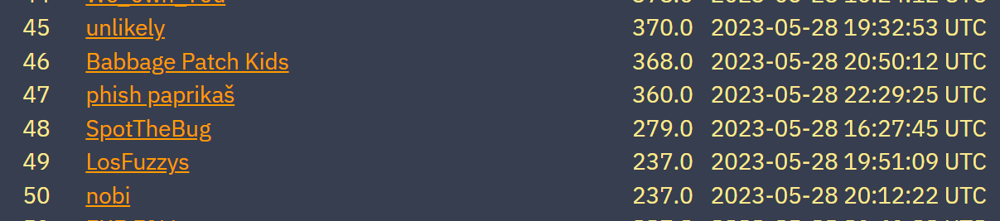
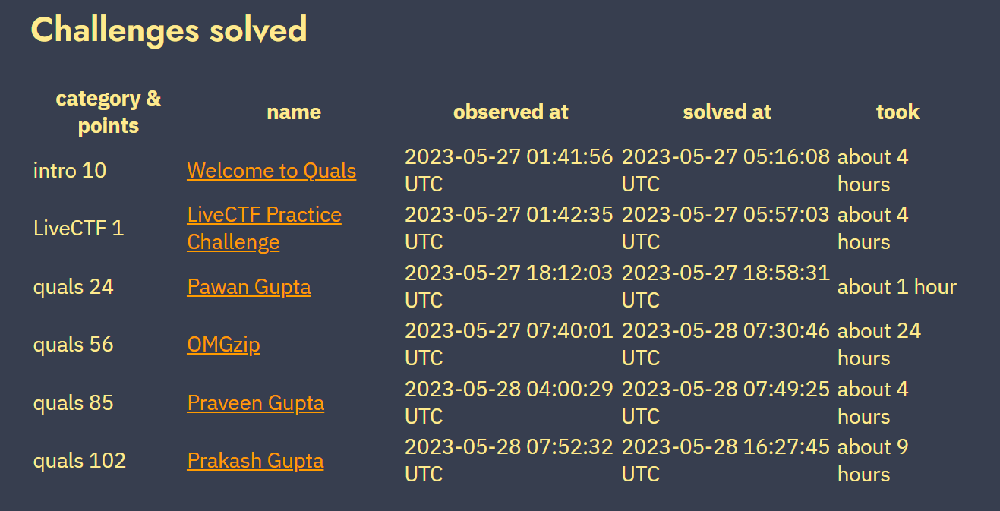
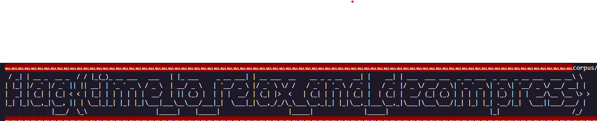

# DEF CON qualification 2023

[link scoreboard](https://quals.2023.nautilus.institute/scoreboard.html)

In this competition, my team achieved the top 48 and our team name was SpotTheBug:



The solved challenges were as follows:



I will not elaborate on "Intro 10" and "LiveCTF 1" as they were two warm-up challenges.

## OMGzip

This challenge pertains to file compression technique, specifically the utilization of the zip format, which is quite unconventional.

The process of zipping a file utilizes a tree structure, where the leaves represent individual bytes ranging from 0 to 255, totaling 256 leaves. The compression process is akin to storing the path from the root to the leaf corresponding to each byte.

I renamed the class "Family" to "Tree".

```py
@dataclass
class Tree:
    value: int
    left: "Tree" = None
    right: "Tree" = None
    parent: "Tree" = None
```

The decoding process is as follows:

```py
    def decode(self,stream:bytes):
        """
        Decodes things.
        """
        ret = []
        bin_str = "".join(['{0:08b}'.format(stream[i]) for i in range(len(stream))])
        i = 0
        current = self.money
        while i<len(bin_str):
            c = bin_str[i]
            Next = None
            if c=='0':
                Next = current.left
            else:
                Next = current.right

            if Next==None:
                ret.append(current.value)
                self._magic(current)
                # back to root node
                root = current
                while root.parent is not None:
                    root = root.parent
                current = root
            else:
                current = Next
                i+=1
        return ret
```

I iterate through each bit in the compressed data, starting from a node initialized as 'self.money'. If the bit is 0, I move to the left; if it is 1, I move to the right. If the current node is a leaf, I append the byte within that node to the result array, and then execute 'self.magic' to update the state. Afterward, I return to the root node to process the next bits.

Decompress:

```py
def decompress(input_data:bytes) -> bytes:
    infl = Deflater()
    encoded_data = infl.decode(input_data[6:])
    idx = 0 # index
    ret = []
    while idx < len(encoded_data)-2:
        if encoded_data[idx]==255 and encoded_data[idx+1]!=255:
            count = encoded_data[idx+1]
            data = encoded_data[idx+2]
            if data==255:
                count+=2
            else:
                count+=3
            ret.extend([data]*count)
            idx+=3
        elif encoded_data[idx]==255 and encoded_data[idx+1]==255:
            ret.append(255)
            idx+=2
        else:
            ret.append(encoded_data[idx])
            idx+=1
    return bytes(ret)
```

After running the decode process, I obtain the flag:


## Pawan Gupta:

Let's take a look at the main code snippet of this challenge together:

```py
def main():
    print("Welcome to Level 0 of Pawan Gupta, the ultimate secure code generator!")
    print("Your goal is to leak the flag that only Pawan Gupta knows about.")
    print_flag_hash()
    print()
    prompt_prefix = [REDACTED] f"{FLAG}"

    # getting the prompt
    prompt = input("Your prompt: ")
    print("Generating an awesome output...")
    sys.stdout.flush()

    if len(prompt) > 1024:
        print("Prompt-Sanitizer: Your prompt is too long. Make it shorter than 1024 characters!")
        return

    content = gpt_query(prompt_prefix, prompt)

    if DEBUG:
        print(content)

    level_0(content)
```

This challenge will prompt us to input a sentence for the GPT-3.5-turbo model to generate a response. The flag is included within a prefix and a phrase that roughly says 'hide the flag segment after.' If the returned text contains the flag, it will not be displayed.

I suggest inputting a prompt that is the reverse of the entire sentence, so that the reversed flag can bypass the filter.

## Praveen Gupta and Prakash Gupta

### Praveen Gupta

This challenge is similar to the Pawan Gupta challenge, except that instead of having the flag within the prompt, the flag is stored in a file. Your task now is to write a prompt that instructs the GPT model to generate code that retrieves the flag. The unique aspect here is that there will be an error returned by the program.

The additional constraints for input in the 'sanitize_prompt' section and output in the 'sanitize' section are as follows:

```py
def sanitize_prompt(content: str) -> bool:
    disabled_strings = [
        "system",
        "popen",
        "strcpy",
        "strcat",
        "printf",
        "flag",
        "fopen",
        "fread",
        "open",
        "read",
        "\\x",
        "#include",
        "*",
        "{",
        "}",
        ";",
        "__asm",
        "syscall",
        "SYS_",
    ]
    for s in disabled_strings:
        if s in content:
            return False
    return True


def sanitize(content: str) -> bool:
    disabled_strings = [
        "system",
        "popen",
        "strcpy",
        "strcat",
        "printf",
        "flag",
        "fopen",
        "fread",
        "open",
        "read",
        "\\x",
    ]
    for s in disabled_strings:
        if s in content:
            return False
    return True
```

My idea for this challenge is to include the flag file due to the presence of compile errors. Since the flag file contains only one line, you can obtain the complete flag. However, the prompt input filters out the 'include' keyword, so you plan to use an assembly trick to include the file.

`#define f(arg) arg ##sm NL f(a)("." "i" "n" "c" "l" "u" "d" "e" " " """ "/" "f" "l" "a" "g" """) SC`

I instruct the GPT model to replace 'NL' with '\n' and 'SC' with ';'. Since the returned output of the prompt is filtered and loses the 'asm' keyword, you use the pattern '##' to concatenate strings. Then, during the compilation process, the compiler will merge the characters together.

## Prakash Gupta

I don't know what the difference is, but inputting the previous prompt is still correct.
