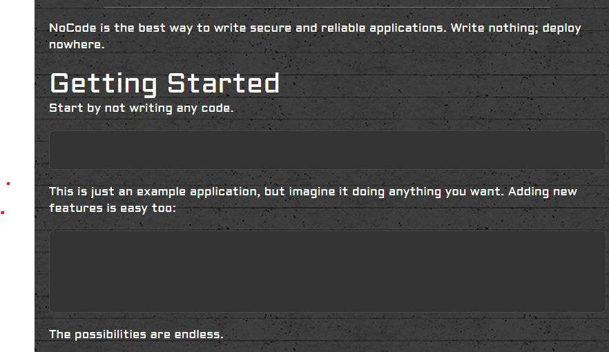

# SEECTF 2023

## MISC

### Android Zoo

Bài này nói về cách bruteforce tim pasword từ hash của android 5.1 6.0 (PIN/pattern/password). Bài chia ra 2 devices, 1 cái tìm pattern (kiểu như là cái vẽ để mở khóa điện thoại), cái còn lại thì là bruteforce tim pasword dài 11 ký tự

Hãy cùng bắt đầu với thiết bị đầu tiên:
Trong file .xml đầu tiên cho thông tin như sau:
```xml
<active-password quality="65536" length="5" uppercase="0" lowercase="0" letters="0" numeric="0" symbols="0" nonletter="0" />
```
Có thể thấy pattern biểu diễn bằng 5 số.

Các file còn lại lần lượt là device.txt cho biết thông tin thiết bị là android 6.0. File gatekeeper.pattern.key lưu một số thông tin liên quan đến pattern dùng để mở khóa điện thoại. File locksettings.db lưu một số thông tin khác trong đó có chứa salt.

Sau khi tìm một lúc thì mình tìm được github [AndroidPin-Crack](https://github.com/Vxer-Lee/AndroidPin-Crack)

Dựa vào đó thì mình viết lại cái script để brute bài này:

```py
import struct
import binascii
import scrypt
from tqdm import tqdm
import itertools

N = 16384
r = 8
p = 1
f = open("gatekeeper.pattern.key", "rb")
blob = f.read() 
s = struct.Struct('<'+'17s 8s 32s')
(meta, salt, signature) = s.unpack_from(blob)

digits = '0123456789'
word_list = [''.join(p) for p in itertools.product(digits, repeat=5)]

for data in tqdm(word_list[::-1]):    
    password=data.strip()       
    to_hash = meta    
    to_hash += password.encode()
    hash = scrypt.hash(to_hash, salt, N, r, p)  
    if hash[0:32] == signature:  
        print(password)
        exit()
```
Pattern tìm được là 95184

Tiếp theo đến với thiết bị 2:

Bài này cho 2 file quan trọng là locksettings.db chứa salt hash và password.key chứa SHA1 (40 bytes đầu), MD5(32 bytes cuối).

Mình kiếm được cái script đâu đó mà mình lười tìm lại:

```py
import os
import hashlib
import sqlite3
import struct
import binascii

#I am reading from a file called settings.db and the salt for the password is stored in this database.
sqlite_file = "locksettings.db"
table_name = "secure"
id_column = "_id"
name = "name"
value = "value"
conn = sqlite3.connect(sqlite_file)
c = conn.cursor()
c.execute("SELECT `value` FROM `locksettings` WHERE `name`='lockscreen.password_salt'")     
name_exists = c.fetchone()
if name_exists:
    salt=(int(name_exists[0]))
    hexsalt=binascii.hexlify((struct.pack('>q',(int(salt))))) 
else:
    print("does not exist")
conn.close()

#In password.key the md5 and sha1 hashes of the password are stored in one long string
file = open("password.key", "rb")
sha1=(file.read(40))
md5=(file.read(32))

passwordhash = md5.decode().lower()
print("MD5 hash read in from password.key: " + passwordhash)
print("Lockscreen Salt read from settings.db: " + str(salt))

#In device_policies.xml it shows the length of the password so the program will only try that length of password
xml_file = open("device_policies.xml", "r")
xml_file = (xml_file.read())
codelength = int(xml_file.split('length="')[1].split('"')[0])
```

Cái này sẽ extract salt và md5 password. Cuối cùng là lấy salt và md5 password để đi bruteforce. Mình dùng hashcat nên format sẽ là password:salt -> 66eb31bd62afe3e486004ce6ecec885c:700f64fafd7f6944

Và đây là kết quả:


### 1337 Word Search

Bài này cho một file chứa một đống ký tự trong đó chứa flag theo chiều ngang dọc hoặc chéo. Do file khá lớn nên việc tìm tay có vẻ không khả thi nên mình tìm một số tool wordsearch solver để giải bài này. Do khá dài nên mình không viết ở đây, bạn có thể vào ./1333WordSearch/ để xem. Sau khi đã tìm được ví trị của flag thì mình thực hiện in nó ra:

```py

file = 'wordsearch1.txt'
wordsearch = open(file).read().splitlines()

pos = [[487, 953], [486, 952], [485, 951], [484, 950]]

i = pos[0][0]
j = pos[0][1]
flag = ''

while '}' not in flag:
    flag += wordsearch[i][j]
    i -= 1
    j -= 1
    
print(flag) 
```

### NoCode

Bài này cho một đống ký tự trống, nếu mà nhìn bằng mắt thường thì nó không khác gì nhau, nhưng mà mình thử inspect thì phát hiện có 2 loại là khoảng trắng thật và giả, do đó mình nghĩ tới encode binary:



```py
s = "&ZeroWidthSpace; &ZeroWidthSpace; &ZeroWidthSpace;&ZeroWidthSpace;  &ZeroWidthSpace; &ZeroWidthSpace;&ZeroWidthSpace;&ZeroWidthSpace; &ZeroWidthSpace; &ZeroWidthSpace; &ZeroWidthSpace;&ZeroWidthSpace;&ZeroWidthSpace; &ZeroWidthSpace; &ZeroWidthSpace;    &ZeroWidthSpace;  &ZeroWidthSpace;   &ZeroWidthSpace;  &ZeroWidthSpace;&ZeroWidthSpace;  &ZeroWidthSpace;&ZeroWidthSpace;&ZeroWidthSpace;&ZeroWidthSpace; &ZeroWidthSpace;  &ZeroWidthSpace;   &ZeroWidthSpace;&ZeroWidthSpace;  &ZeroWidthSpace; &ZeroWidthSpace;&ZeroWidthSpace; &ZeroWidthSpace;  &ZeroWidthSpace;  &ZeroWidthSpace;&ZeroWidthSpace;&ZeroWidthSpace;  &ZeroWidthSpace;  &ZeroWidthSpace;&ZeroWidthSpace;&ZeroWidthSpace;  &ZeroWidthSpace;&ZeroWidthSpace;&ZeroWidthSpace;&ZeroWidthSpace; &ZeroWidthSpace;&ZeroWidthSpace; &ZeroWidthSpace;   &ZeroWidthSpace;&ZeroWidthSpace;  &ZeroWidthSpace; &ZeroWidthSpace; &ZeroWidthSpace;&ZeroWidthSpace;   &ZeroWidthSpace;&ZeroWidthSpace;  &ZeroWidthSpace;&ZeroWidthSpace; &ZeroWidthSpace;   &ZeroWidthSpace;&ZeroWidthSpace;  &ZeroWidthSpace;    &ZeroWidthSpace;   &ZeroWidthSpace;&ZeroWidthSpace; &ZeroWidthSpace;&ZeroWidthSpace;  &ZeroWidthSpace;&ZeroWidthSpace;   &ZeroWidthSpace; &ZeroWidthSpace;     &ZeroWidthSpace;  &ZeroWidthSpace;&ZeroWidthSpace; &ZeroWidthSpace;&ZeroWidthSpace;&ZeroWidthSpace;  &ZeroWidthSpace;&ZeroWidthSpace;  &ZeroWidthSpace;&ZeroWidthSpace;  &ZeroWidthSpace;&ZeroWidthSpace; &ZeroWidthSpace; &ZeroWidthSpace;&ZeroWidthSpace;  &ZeroWidthSpace;  &ZeroWidthSpace;&ZeroWidthSpace;  &ZeroWidthSpace;&ZeroWidthSpace;&ZeroWidthSpace;&ZeroWidthSpace; &ZeroWidthSpace;&ZeroWidthSpace;  &ZeroWidthSpace;&ZeroWidthSpace;&ZeroWidthSpace;&ZeroWidthSpace;&ZeroWidthSpace;&ZeroWidthSpace;  &ZeroWidthSpace; &ZeroWidthSpace; &ZeroWidthSpace;  &ZeroWidthSpace;&ZeroWidthSpace;&ZeroWidthSpace;  &ZeroWidthSpace;  &ZeroWidthSpace;&ZeroWidthSpace;&ZeroWidthSpace;  &ZeroWidthSpace;  &ZeroWidthSpace;&ZeroWidthSpace;&ZeroWidthSpace; &ZeroWidthSpace;&ZeroWidthSpace;  &ZeroWidthSpace;&ZeroWidthSpace; &ZeroWidthSpace; &ZeroWidthSpace;  &ZeroWidthSpace;&ZeroWidthSpace;&ZeroWidthSpace;  &ZeroWidthSpace;&ZeroWidthSpace;   &ZeroWidthSpace;&ZeroWidthSpace; &ZeroWidthSpace;  &ZeroWidthSpace;&ZeroWidthSpace;&ZeroWidthSpace; &ZeroWidthSpace;&ZeroWidthSpace;  &ZeroWidthSpace;&ZeroWidthSpace; &ZeroWidthSpace;&ZeroWidthSpace;&ZeroWidthSpace;  &ZeroWidthSpace;&ZeroWidthSpace;&ZeroWidthSpace;&ZeroWidthSpace; &ZeroWidthSpace;&ZeroWidthSpace;  &ZeroWidthSpace; &ZeroWidthSpace;&ZeroWidthSpace;&ZeroWidthSpace;&ZeroWidthSpace;   &ZeroWidthSpace;&ZeroWidthSpace; &ZeroWidthSpace;  &ZeroWidthSpace;&ZeroWidthSpace;&ZeroWidthSpace;  &ZeroWidthSpace;  &ZeroWidthSpace;&ZeroWidthSpace; &ZeroWidthSpace;&ZeroWidthSpace;&ZeroWidthSpace;&ZeroWidthSpace;  &ZeroWidthSpace;&ZeroWidthSpace;&ZeroWidthSpace; &ZeroWidthSpace;  &ZeroWidthSpace;&ZeroWidthSpace;&ZeroWidthSpace; &ZeroWidthSpace;&ZeroWidthSpace;&ZeroWidthSpace;  &ZeroWidthSpace;   &ZeroWidthSpace;&ZeroWidthSpace;  &ZeroWidthSpace;&ZeroWidthSpace;&ZeroWidthSpace;&ZeroWidthSpace;&ZeroWidthSpace;  &ZeroWidthSpace;&ZeroWidthSpace;&ZeroWidthSpace; &ZeroWidthSpace;&ZeroWidthSpace;&ZeroWidthSpace;  &ZeroWidthSpace;&ZeroWidthSpace; &ZeroWidthSpace;&ZeroWidthSpace;&ZeroWidthSpace;  &ZeroWidthSpace;  &ZeroWidthSpace;&ZeroWidthSpace;&ZeroWidthSpace;   &ZeroWidthSpace;&ZeroWidthSpace; &ZeroWidthSpace;&ZeroWidthSpace;  &ZeroWidthSpace;&ZeroWidthSpace; &ZeroWidthSpace;&ZeroWidthSpace;  &ZeroWidthSpace;&ZeroWidthSpace;&ZeroWidthSpace; &ZeroWidthSpace;&ZeroWidthSpace;&ZeroWidthSpace;  &ZeroWidthSpace; &ZeroWidthSpace;&ZeroWidthSpace;&ZeroWidthSpace;&ZeroWidthSpace;  &ZeroWidthSpace; &ZeroWidthSpace; &ZeroWidthSpace;     &ZeroWidthSpace; "
s = s.replace("&ZeroWidthSpace;", "0").replace(" ", "1")

byte_value = int(s, 2)
byte = byte_value.to_bytes((byte_value.bit_length() + 7) // 8, 'big')

print(byte.decode())

```

## Crypto

### Dumb Chall

Bài này cho 3 tham số p (prime), g (random number), y = g^flag (mod p) và nhiệm vụ của chúng ta là phải qua được 30 lần check ngẫu nhiên 2 điều kiện:

```py
def first_verify(g, p, y, C, w, r) -> bool:
    assert w
    return ((y * C) % p) == pow(g, w, p)


def second_verify(g, p, y, C, w, r) -> bool:
    assert r
    return pow(g, r, p) == C
```

Với C mỗi lần là duy nhất. Vậy đơn giản ở hàm đầu thì mình random w rồi tìm C, hàm 2 thì random r rồi tìm C.

```py
from pwn import *
from random import getrandbits

conn = remote('win.the.seetf.sg', 3002)

line = conn.recvline()
print(line)
p = int(line[4:])

line = conn.recvline()
print(line)
g = int(line[4:])

line = conn.recvline()
print(line)
y = int(line[4:])

print(conn.recvline())
print(conn.recvline())

def first_verify(g, p, y, C, w, r) -> bool:
    assert w
    return ((y * C) % p) == pow(g, w, p)


def second_verify(g, p, y, C, w, r) -> bool:
    assert r
    return pow(g, r, p) == C

seen_c = set()
for round in range(30):
    opt = conn.recv()
    print(opt)
    if b'w' in opt:
        while True:
            w = getrandbits(128)
            C = pow(g, w, p) * pow(y, -1, p)
            if not C in seen_c:
                seen_c.add(C)
                break
        conn.sendline(str(w).encode())
        conn.sendline(str(C).encode())
    elif b'r' in opt:
        while True:
            r = getrandbits(128)
            C = pow(g, r, p)
            if not C in seen_c:
                seen_c.add(C)
                break
        conn.sendline(str(r).encode())
        conn.sendline(str(C).encode())
    print(conn.recvline())

conn.interactive()
```

### BabyRC4

Bài này dùng cùng một key để mã flag và một chuỗi "a"*36 bằng RC4. Mà do RC4 là một stream cipher nên dễ dùng để tìm được flag bằng cách c1 xor c2 xor "a"*36

```py
from pwn import xor

c0 = bytes.fromhex('b99665ef4329b168cc1d672dd51081b719e640286e1b0fb124403cb59ddb3cc74bda4fd85dfc')
c1 = bytes.fromhex('a5c237b6102db668ce467579c702d5af4bec7e7d4c0831e3707438a6a3c818d019d555fc')

print(xor(xor(b'a'*36, c0), c1)[::-1])

```

### OpenEndedRSA 

Bài này là một bài RSA bình thường với modulus 1024 bits, và cho thêm một số s = p^2 + pp^2 với pp là một số ngẫu nhiên và p là factor là n. Mình dùng [tool online](https://www.alpertron.com.ar/ECM.HTM) và tìm được pp = 2. Việc còn lại thì giải mã là xong:

```py
from Crypto.Util.number import *
from gmpy2 import iroot # this helps with super accurate square root calculations!


n = ...
e = 65537
c = ...
s = ...

p = iroot(s-4, 2)[0]

assert isPrime(p)

assert n%p == 0

q = n//p

d = pow(e, -1, (p-1)*(q-1))
print(long_to_bytes(pow(c, d, n)).decode())
```
